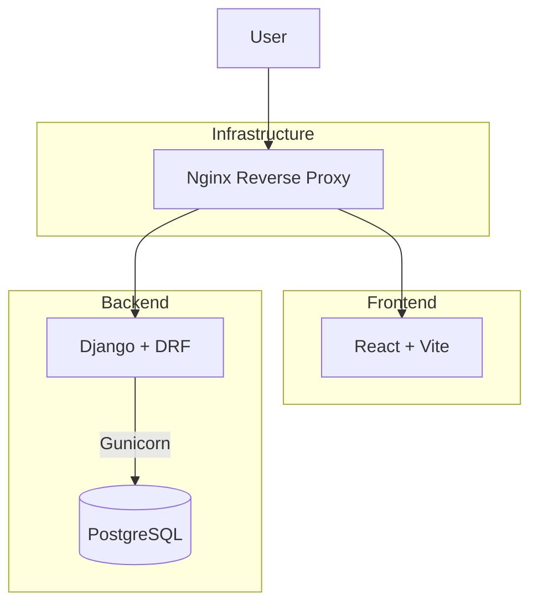
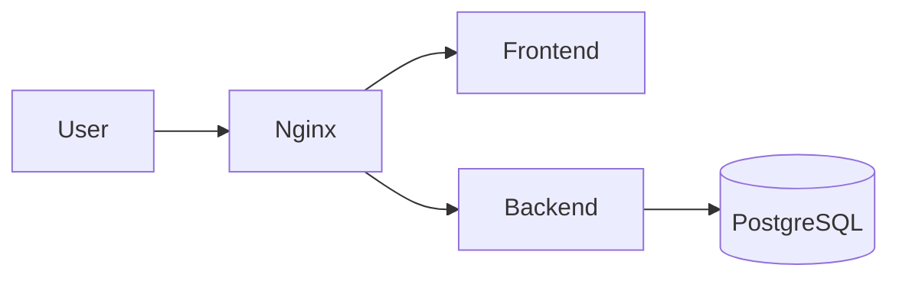

# Project A

[](https://www.djangoproject.com/)
[](https://react.dev/)
[](https://vitejs.dev/)
[](https://www.docker.com/)
[](https://www.postgresql.org/)
[](LICENSE)

> **Project A** is a production-oriented full-stack boilerplate project built with **Django (backend)**, **React + Vite (frontend)**, **PostgreSQL**, and containerized with **Docker**.  
> The goal of this project is to serve as a **real-world scalable boilerplate** for building enterprise-level web applications from scratch.

---

## Table of Contents

- [Features](#-features)
- [Tech Stack](#-tech-stack)
- [Architecture](#-architecture)
- [Docker Architecture](#-docker-architecture)
- [Directory Structure](#-directory-structure)
- [Environment Variables](#-environment-variables)
- [Local Development](#-local-development)
- [Production Deployment](#-production-deployment)
- [Quickstart](#-quickstart)
- [CI/CD](#-cicd)
- [Contributing](#-contributing)
- [Roadmap](#-roadmap)
- [License](#-license)

---

## Features

- Django backend with Django REST Framework
- React frontend built with Vite
- PostgreSQL database
- Nginx reverse proxy (production)
- Gunicorn WSGI server for production
- Multi-stage Docker builds (dev/prod)
- Environment-based settings via `django-environ`
- Hot reload for frontend development
- Modular architecture suitable for large teams and enterprise deployment

---

## Tech Stack

| Layer            | Technology                    | Notes                                       |
|-------------------|-------------------------------|---------------------------------------------|
| Backend           | Django + DRF                  | API backend, Gunicorn in production         |
| Frontend          | React + Vite                  | Fast dev build system with hot reload       |
| Database          | PostgreSQL                    | Persistent storage                          |
| Reverse Proxy     | Nginx                         | Production reverse proxy                    |
| Containerization  | Docker, Docker Compose        | Dev & prod multi-stage builds              |
| CI/CD (Planned)   | GitHub Actions                | Automated testing and deployment pipeline  |

---

## Architecture



---

## Docker Architecture

Project A runs as a **multi-container Docker application** connected through Docker networks:

- `frontend` container: React/Vite dev server or static build
- `backend` container: Django + Gunicorn
- `db` container: PostgreSQL
- `nginx` container: reverse proxy in production
- Shared network(s) allow services to communicate internally
- Volumes are used for data persistence and static/media handling



**Development:** Frontend runs with hot reload, Django runs with development server.  
**Production:** Nginx handles traffic, Django served by Gunicorn.

---

## Directory Structure

```
ProjectA/
├── backend/              # Django backend (detailed structure in backend/README.md)
├── frontend/             # React frontend (detailed structure in frontend/README.md)
├── nginx/                # Nginx reverse proxy config
├── docs/
│   ├── ROADMAP.md
│   └── CONTRIBUTING.md
├── .env.example
├── .env.hosts.example
├── .gitignore
├── docker-compose.dev.yml
├── docker-compose.prod.yml
└── README.md
```

> Detailed structure for backend and frontend can be found in their respective `README.md` files.

---


## Environment Variables

Project A uses a single environment file, **.env**, to configure all Django and project settings.
This file defines application, database, and email configuration values that Django loads automatically via django-environ.

---

### .env and .env.example

The .env.example file in the project root provides a template for all required variables.
To get started, copy it and adjust values for your environment:

```bash
cp .env.example .env
```

Then edit .env with your actual secrets and configuration details.

---

### Example: .env.example

```env
# ============================================================
# Django Core Settings
# ============================================================

DJANGO_SETTINGS_MODULE=config.settings.dev
DJANGO_SECRET_KEY=change-me-to-a-very-secret-value
DJANGO_DEBUG=True  # Set to False in production!

# Allowed hosts (comma separated)
DJANGO_ALLOWED_HOSTS=localhost,127.0.0.1

# ============================================================
# Database Configuration
# ============================================================

# Database (single URL format)
# postgres://<USER>:<PASSWORD>@<HOST>:<PORT>/<DATABASE_NAME>
DATABASE_URL=postgres://postgres:postgres@db:5432/project_a

# ============================================================
# Email Configuration
# ============================================================

# Development backend (prints emails to console)
EMAIL_BACKEND=django.core.mail.backends.console.EmailBackend

# Production backend (SMTP example)
# EMAIL_BACKEND=django.core.mail.backends.smtp.EmailBackend
# EMAIL_HOST=smtp.example.com
# EMAIL_PORT=587
# EMAIL_USE_TLS=True
# EMAIL_HOST_USER=user@example.com
# EMAIL_HOST_PASSWORD=your_password
# DEFAULT_FROM_EMAIL=webmaster@example.com


# ============================================================
# Frontend Configuration
# ============================================================

# Public URL your frontend will call (used by Vite/React)
VITE_API_URL=http://backend:8000
```


---

## Local Development

```bash
# Start full stack
docker compose -f docker-compose.dev.yml up --build

# Backend only
docker compose -f docker-compose.dev.yml up backend db

# Frontend only
docker compose -f docker-compose.dev.yml up frontend
```

- Frontend: Vite dev server with hot reload  
- Backend: Django development server  
- Database: PostgreSQL  
- Containers communicate via internal Docker network

---

## Production Deployment

```bash
# Build and start containers in detached mode
docker compose -f docker-compose.prod.yml up --build -d
```

- Frontend → `http://yourdomain.com`  
- API → `http://yourdomain.com/api/`  
- Nginx handles reverse proxying to frontend and backend

---

## Quickstart

```bash
git clone https://github.com/austinperrin/project_a.git
cd project_a

cp .env.example .env

docker compose -f docker-compose.dev.yml up --build
```

Then:
- Frontend: `http://localhost:5173`
- Backend: `http://localhost:8000`
- API: `http://localhost:8000/api/`

---

## CI/CD

- Planned CI/CD using **GitHub Actions**
- Future improvements:
  - Automated tests on PRs
  - Linting checks
  - Staging & production workflows
  - Optional Docker Hub builds

---

## Contributing

Contribution guidelines are available in:  
[docs/CONTRIBUTING.md](./docs/CONTRIBUTING.md)

---

## Roadmap

[docs/ROADMAP.md](./docs/ROADMAP.md)

---

## License

No license has been added yet.  
A suitable license will be added when the project reaches a stable stage.
